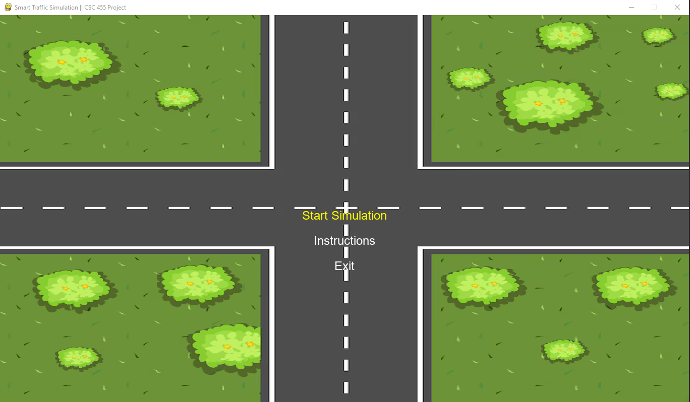

# Smart Traffic Simulation

This project is a Python-based simulation tool designed for CSC455, aimed at modeling and analyzing smart traffic systems. It leverages advanced programming techniques and modular design to provide a practical environment for experimenting with traffic flow, control algorithms, and system optimization.

## Installation

### Windows

1. Clone the repository:
    ```console
    git clone https://github.com/0xh7ml/trafficgame.git
    ```
2. Navigate to the project directory:
    ```console
    cd trafficgame
    ```
3. Install dependencies (using Python and pip as an example):
    ```console
    python -m venv venv
    venv\Scripts\activate
    pip install -r requirements.txt
    ```

### Linux

1. Clone the repository:
    ```console
    git clone https://github.com/0xh7ml/trafficgame.git
    ```
2. Navigate to the project directory:
    ```console
    cd trafficgame
    ```
3. Install dependencies:
    ```console
    python3 -m venv venv
    source venv/bin/activate
    pip3 install -r requirements.txt
    ```

### Project Structure
    assets:
       - vehicle image, background image
    audio:
       - vehicle sound
    main.py: game file
    requirements.txt: dependency file